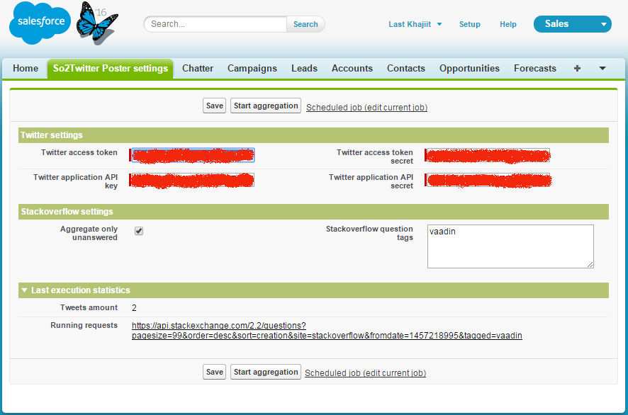

# so2twitter-poster

  

Bot for posting new Stackoverflow questions to Twitter, created in Salesforce.

 

Bot aggregates Stackoverflow questions over the past 24 hours, and tweets their. You can note exact tags for questions and choose - should it look for only unanswered questions or not.

Settings page:

[My twitter-bot](https://twitter.com/boguslau_ducker):

###Deploy and configuration 
1. Click "Deploy to Salesforce" button or clone and deploy it manually
2. Use your Twitter acc for creation Twitter app [https://apps.twitter.com/](https://apps.twitter.com/)
3. Go to Salesforce "So2Twitter Poster settings" tab and fill all the necessary settings  (use twitter-related from previous step)
4. Click "Aggregate now" button and check job execution results in Twitter
5. For scheduling iterative execution click "Scheduled job" link, past *SO2TP_ScheduleTweetGenerator* in Job Name and Apex Class fields and set Frequency

###Known issues:
1. Add processing of all retrieved questions (not only first result page)
2. Fix issue with multiple tags (future methods-related)
3. Missed exception processing & validation

*Feel free to make pull requests!*

---

**Copyright © 2016 Last Khajiit <last.khajiit@gmail.com>**

This work is free. You can redistribute it and/or modify it under the
terms of the Do What The Fuck You Want To Public License, Version 2,
as published by Sam Hocevar. See the [COPYING](copying.txt) file for more details.
